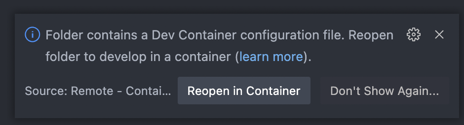

# idris2-hello-world

This is a very simple [Idris2](https://github.com/idris-lang/Idris2) project to test and demo local dev environemnt using [VS Code Devcontainer](https://code.visualstudio.com/docs/remote/containers) and [idris-2-docker](https://github.com/joshuanianji/idris-2-docker).

## Setup and run the project

You don't need to install Idris2 or idris2-lsp, those tools are already installed in devcontainer. All you need to setup in your computer are:

* [Docker](https://docs.docker.com/get-docker/)
* [VSCode](https://code.visualstudio.com/download)
* [Remote Development Extension Pack](https://marketplace.visualstudio.com/items?itemName=ms-vscode-remote.vscode-remote-extensionpack) for VSCode

Then checkout the code locally:

```bash
git clone https://github.com/jiwhiz/idris2-hello-world.git
```

In VS Code, open the project folder. Since it has dev container config, VS Code will prompt on the bottom right with:



Click "Reopen in Container" and it will download the image and open the project in a devcontainer. Make sure you have docker running locally, and see the new container for this idris2-hello-world.

Open a new Terminal in VS Code, and you can check the idris2 and idris2-lsp version:

```
vscode ➜ /workspaces/idris2-hello-world $ idris2 --version
Idris 2, version 0.6.0-dc1b5387b
vscode ➜ /workspaces/idris2-hello-world $ idris2-lsp --version
Idris2 LSP: 0.1.0-7fa662a2a
Idris2 API: 0.6.0-dc1b5387b
```

To build and run `hello.idr` in command line, just type:

```
vscode ➜ /workspaces/idris2-hello-world $ idris2 hello.idr -o hello
vscode ➜ /workspaces/idris2-hello-world $ ./build/exec/hello
Hello Idris World!
```

Or run inside Idris REPL:

```
vscode ➜ /workspaces/idris2-hello-world $ idris2 hello.idr
     ____    __     _         ___
    /  _/___/ /____(_)____   |__ \
    / // __  / ___/ / ___/   __/ /     Version 0.6.0-dc1b5387b
  _/ // /_/ / /  / (__  )   / __/      https://www.idris-lang.org
 /___/\__,_/_/  /_/____/   /____/      Type :? for help

Welcome to Idris 2.  Enjoy yourself!
Main> :exec main
Hello Idris World!
Main> 
```


**Notes**

The Idris2 version installed is the [submodule under idris2-lsp](https://github.com/idris-community/idris2-lsp), may not be the latest in [Idris2 repo](https://github.com/idris-lang/Idris2).

Since idris2-lsp is not released yet, right now we build devcontainer image from their main branch.
